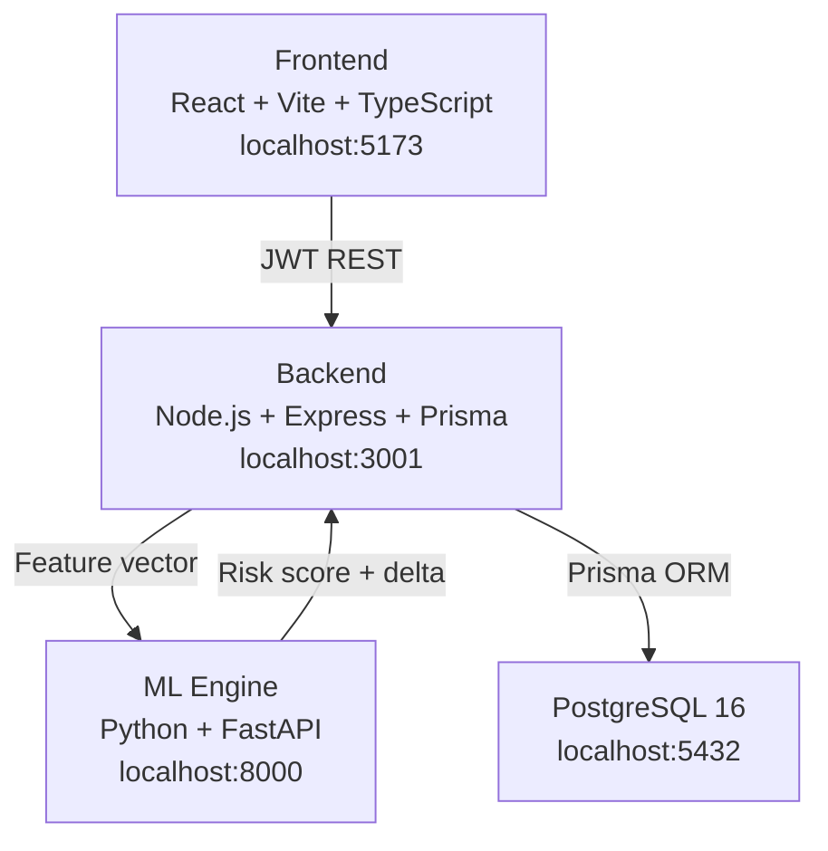

# Quantum State Financial Engine (QFSE)

<<<<<<< HEAD
> **Pre-Delinquency Intervention Platform** — Detects financial instability before default using ML and enables predictive, data-driven intervention.

---

## Architecture



```
/QFSE
├── frontend/         React + Vite + TypeScript + TailwindCSS + Recharts
├── backend/          Node.js + Express + Prisma ORM + Zod validation
├── ml-engine/        Python + FastAPI + scikit-learn
├── database/         PostgreSQL schema SQL
└── docker-compose.yml
```

---

## Quick Start (Docker)

```bash
docker-compose up --build
```

**On first boot the system automatically:**
1. Waits for PostgreSQL to be ready
2. Runs `prisma migrate deploy`
3. Seeds 100 synthetic customers (idempotent)
4. Generates ML training dataset (if absent)
5. Trains the Random Forest model (≈60s)
6. Starts all services

| Service    | URL                   |
|------------|-----------------------|
| Frontend   | http://localhost:5173 |
| Backend    | http://localhost:3001 |
| ML Engine  | http://localhost:8000 |
| PostgreSQL | localhost:5432        |

**Default login:** `sarah.chen@qfse.bank` / `Qfse@2025`

---

## Demo Walkthrough

1. **Login** → Enter credentials above
2. **Dashboard** → View live portfolio metrics (total customers, avg risk, intervention success rate)
3. **Persona View** → Distribution pie charts (persona + risk state breakdown)
4. **List View** → Filter customers by risk state; click any customer
5. **Customer Profile** → Quantum state probabilities, active signals, wave function graph, entanglement network
6. **Simulator** → Select customer + intervention strategy → Execute → See ML-computed `delta`, `originalRisk`, `simulatedRisk`, `riskReductionPct`
7. **Entanglement Deep-Dive** → Social-financial topology with contagion score
8. **Timeline** → Chronological event log with communications and interventions

---

## Database Schema Overview

| Model             | Purpose                                      |
|-------------------|----------------------------------------------|
| `User`            | Analyst accounts (JWT auth)                  |
| `Persona`         | Customer risk archetypes (Chronic Stresser…) |
| `Customer`        | Core financial profile + ML feature columns  |
| `RiskScore`       | ML-computed probability snapshots over time  |
| `Loan`            | Loan portfolio per customer                  |
| `Entanglement`    | Social-financial links (family, guarantor…)  |
| `Intervention`    | Simulated and applied intervention history   |
| `CommunicationLog`| Communication events with behavioral impact  |
| `TimelineEvent`   | Chronological event log per customer         |
| `Snapshot`        | Monthly financial snapshots                  |

---

## ML Explanation

The ML engine uses a **Random Forest classifier** trained on 10,000 synthetic customer records.

### Feature Vector (7 features)

| Feature | Description | Range |
|---------|-------------|-------|
| `salary_delay_freq` | How often salary is delayed | 0–1 |
| `credit_utilization_ratio` | Credit card usage vs limit | 0–1 |
| `emi_payment_consistency` | % of EMIs paid on time | 0–1 |
| `withdrawal_spikes` | Unusual ATM withdrawal activity | 0–1 |
| `loan_to_income_ratio` | Loan balance / monthly income | 0–5 |
| `past_intervention_success` | History of responding to interventions | 0–1 |
| `linked_instability_score` | Contagion-weighted network risk (see below) | 0–1 |

### Output
```json
{
  "probability": 0.82,
  "risk_state": "Imminent Default",
  "feature_importance": { "salary_delay_freq": 0.31, "credit_utilization_ratio": 0.22 },
  "confidence_score": 0.64,
  "model_name": "Random Forest"
}
```

### Risk States
| Probability | State |
|-------------|-------|
| < 30% | Healthy |
| 30–50% | Watchlist |
| 50–75% | At Risk |
| > 75% | Imminent Default |

### Simulation Engine
When a strategy is selected, the ML engine modifies relevant features per strategy:

| Strategy | Feature Delta |
|----------|---------------|
| EMI Holiday | `emi_payment_consistency +0.25`, `salary_delay_freq −0.10` |
| Loan Restructuring | `loan_to_income_ratio −0.20`, `emi_payment_consistency +0.15` |
| Partial Payment Plan | `emi_payment_consistency +0.20`, `withdrawal_spikes −0.15` |
| Flexible Repayment | All three features improved |

Returns `{ originalRisk, simulatedRisk, delta, riskReductionPct }` — no static arithmetic.

---

## Entanglement Contagion Model

Each customer can have social-financial links to other customers or external parties.

### Weight Factors

| Link Type | Weight |
|-----------|--------|
| `guarantor` | 0.7 |
| `co_borrower` | 0.6 |
| `family` | 0.5 |
| `shared_address` | 0.4 |
| `shared_employer` | 0.3 |

### Contagion Score Formula

```
contagionScore = (baseRisk + Σ(linkedRisk × weight)) / (1 + Σ(weight))
```

Normalized to **[0, 1]**. A customer with a high-risk guarantor will have their contagion score elevated even if their own base risk is low.

This score also feeds into the ML engine as `linked_instability_score` when running simulations.

### Communication Intelligence

Every communication logged (SMS, email, call) slightly reduces the customer's risk probability:

| Channel | Risk Adjustment |
|---------|----------------|
| `call` | −2.0% |
| `behavioral_alert` | −1.5% |
| `sms_reminder` | −1.0% |
| `email_nudge` | −1.0% |
| Positive response (score > 0.7) | Additional −3.0% |

---

## API Reference

### Auth
| Method | Endpoint | Description |
|--------|----------|-------------|
| POST | `/api/auth/login` | Login → returns JWT |

### Customers
| Method | Endpoint | Description |
|--------|----------|-------------|
| GET | `/api/customers` | List (filterable by persona, riskState) |
| GET | `/api/customers/:id` | Full profile + timeline + loans |
| POST | `/api/customers/:id/refresh-risk` | Re-score via ML |
| GET | `/api/customers/:id/timeline` | Chronological events |
| GET | `/api/customers/:id/risk-history` | Risk trend |

### Interventions
| Method | Endpoint | Description |
|--------|----------|-------------|
| POST | `/api/interventions/simulate` | Simulate → returns `{originalRisk, simulatedRisk, delta}` |
| POST | `/api/interventions` | Save applied intervention |
| GET | `/api/interventions?customerId=X` | Intervention history |

### Entanglements
| Method | Endpoint | Description |
|--------|----------|-------------|
| GET | `/api/entanglements/:customerId` | Social-financial graph + contagionScore |

### Communications
| Method | Endpoint | Description |
|--------|----------|-------------|
| GET | `/api/communications/:customerId` | Communication log (filterable) |
| POST | `/api/communications/log` | Log event → adjusts risk score |
| PATCH | `/api/communications/:id/outcome` | Update response outcome |

### Analytics
| Method | Endpoint | Description |
|--------|----------|-------------|
| GET | `/api/analytics/summary` | Portfolio overview |
| GET | `/api/analytics/personas` | Persona distribution |
| GET | `/api/analytics/risk-migration` | Risk state trends |

### ML Engine
| Method | Endpoint | Description |
|--------|----------|-------------|
| GET | `/health` | Model metadata + accuracy |
| POST | `/predict-risk` | Predict default probability |
| POST | `/simulate-intervention?action_type=X` | Simulate with delta |
| POST | `/retrain` | Trigger background retraining |

---

## Local Development

### Prerequisites
Node.js 20+, Python 3.11+, PostgreSQL 16

```bash
# 1. Database
psql -U postgres -c "CREATE USER qfse_user WITH PASSWORD 'qfse_password';"
psql -U postgres -c "CREATE DATABASE qfse_db OWNER qfse_user;"

# 2. Backend
cd backend
cp .env.example .env
npm install
npx prisma migrate dev --name init
npx prisma db seed
npm run dev          # :3001

# 3. ML Engine  
cd ml-engine
pip install -r requirements.txt
python generate_dataset.py
python train_model.py
uvicorn main:app --reload --port 8000

# 4. Frontend
cd frontend
npm install
npm run dev          # :5173
```

---

## Tech Stack

| Layer | Technology |
|-------|-----------|
| Frontend | React 18, Vite 6, TypeScript, TailwindCSS 4, Recharts, Lucide |
| Backend | Node.js 20, Express 4, Prisma 5, JWT, Zod, Helmet, Morgan |
| ML | Python 3.11, FastAPI, scikit-learn, Pandas, NumPy, Joblib |
| Database | PostgreSQL 16 |
| DevOps | Docker, Docker Compose |

**All technologies are 100% free and open-source.**

---

## Running Tests

```bash
cd backend
npm test
```

Covers: login, customer list/detail, simulation delta structure, intervention save, analytics summary, health check.

---

## Future Roadmap

- Real-time WebSocket notifications for Imminent Default state changes
- User role management (Admin vs Analyst) with RBAC
- Expanded CommunicationLog UI with full SMS/email render history
- Automated A/B testing of intervention strategies
- Model explainability (SHAP values) in customer profile view
- Portfolio-level contagion cascade simulation

## Known Limitations

- ML model trained on synthetic data — prediction accuracy improves with real banking data
- Entanglement risk links are seeded; in production these come from loan origination systems
- Communication SMS/email delivery is simulated (no actual send gateway integrated)
- JWT expiry is 7 days; rotation/refresh not yet implemented
=======
Quantum State Financial Engine (QFSE) is a full-stack financial risk intelligence platform that models customer instability, contagion risk propagation, behavioral interventions, and communication impact using a network-driven approach.

The system enables financial institutions to proactively detect, simulate, and mitigate default risk instead of relying solely on static credit scoring models.

---

## 1. Overview

Traditional risk systems evaluate customers independently. QFSE models financial risk as a dynamic ecosystem.

The platform:

1. Predicts individual default probability using machine learning
2. Models interconnected customers through a relationship network
3. Simulates intervention scenarios
4. Tracks communication effectiveness
5. Computes contagion risk propagation
6. Visualizes instability evolution over time

This approach enables proactive risk management.

---

## 2. Architecture

Frontend:

* React
* Vite
* TypeScript
* Axios for API communication

Backend:

* Node.js
* Express
* Prisma ORM
* PostgreSQL

Machine Learning Service:

* Python
* scikit-learn
* Synthetic dataset generation
* Logistic Regression classifier

Infrastructure:

* Docker
* Docker Compose

---

## 3. Core Features

### 3.1 Customer Risk Prediction

* Machine learning model predicts probability of default
* Risk score persisted in database
* Feature-based prediction using financial and behavioral signals
* Probability output normalized between 0 and 1

---

### 3.2 Entanglement Network (Contagion Modeling)

The system models relationships between customers, including:

* Shared address
* Co-borrower
* Guarantor
* Shared employer

Contagion score formula:

contagionScore = baseRisk + Σ(linkedCustomerRisk × weightFactor)

Weight factors:

* Shared address: 0.4
* Co-borrower: 0.6
* Guarantor: 0.7
* Shared employer: 0.3

The final score is normalized between 0 and 1.

The backend returns a structured graph containing:

* Nodes
* Edges
* Contagion score

---

### 3.3 Simulation Engine

The simulation engine enables analysts to model intervention scenarios such as:

* Salary stability improvement
* Debt restructuring
* Behavioral improvement
* Payment discipline enhancement

Simulation flow:

1. Fetch real customer features
2. Modify selected feature
3. Recalculate ML prediction
4. Compute delta between original and simulated risk
5. Persist simulation history

Response format:

{
originalRisk,
simulatedRisk,
delta,
modifiedFeature
}

---

### 3.4 Communication Intelligence Layer

The platform tracks:

* Email communications
* SMS interventions
* Phone calls
* Engagement responses

Communication logs:

* Stored in database
* Displayed in timeline
* Influence behavioral stability
* Adjust overall risk probability

---

### 3.5 Timeline Analytics

Each customer profile includes:

* Key Events Timeline
* Monthly Snapshots
* Quarterly Summary
* Communication history
* Risk evolution tracking

This provides longitudinal visibility into customer instability.

---

## 4. Database Schema Overview

Core models:

* Customer
* RiskScore
* Relationship
* CommunicationLog
* SimulationHistory

Database managed using Prisma ORM.

---

## 5. Machine Learning Model

The ML service includes:

* Synthetic dataset generation
* Feature scaling
* Logistic Regression classifier
* Probability output between 0 and 1
* Model auto-training if model file is missing
* Retraining endpoint support

ML Endpoints:

POST /predict
POST /retrain

Predictions are persisted in the RiskScore table.

---

## 6. Running the Project (Docker)

1. Clone repository:

git clone <repository-url>
cd QFSE

2. Run full stack:

docker-compose up --build

Services:

Frontend: [http://localhost:5173](http://localhost:5173)
Backend: [http://localhost:3001](http://localhost:3001)
PostgreSQL: localhost:5432
ML Service: internal container

System auto-migrates and seeds database on startup.

---

## 7. Development Mode (Without Docker)

Backend:

cd backend
npm install
npx prisma migrate dev
npx prisma db seed
npm run dev

Frontend:

cd frontend
npm install
npm run dev

ML Service:

cd ml
pip install -r requirements.txt
python train.py
python app.py

---

## 8. Security

* JWT-based authentication
* Protected API routes
* Centralized error handling
* Request validation
* Rate limiting
* Environment-based configuration

---

## 9. Demo Flow

1. Open dashboard
2. Select a customer
3. View risk probability
4. Explore entanglement network
5. Review timeline and communication logs
6. Run simulation
7. Observe risk delta
8. Log communication and observe behavioral impact

---

## 10. Design Philosophy

The system is inspired by:

* Network theory
* Probabilistic modeling
* Behavioral finance
* Risk contagion modeling

Risk is modeled as a dynamic state rather than a static score.

---

## 11. Future Improvements

* Graph neural networks for contagion modeling
* Real-time event streaming
* Explainable AI integration (e.g., SHAP)
* Credit bureau data integration
* Role-based dashboards
* CI/CD pipeline
* Production deployment hardening

---

## 12. Known Limitations

* Uses synthetic dataset
* Simplified contagion weights
* Logistic regression baseline model
* No real-world financial institution integration

---

## 13. License

For academic and demonstration purposes.

---

>>>>>>> bb919f29f5db9b45e758fb404a5fa2cc8c19ff8d
